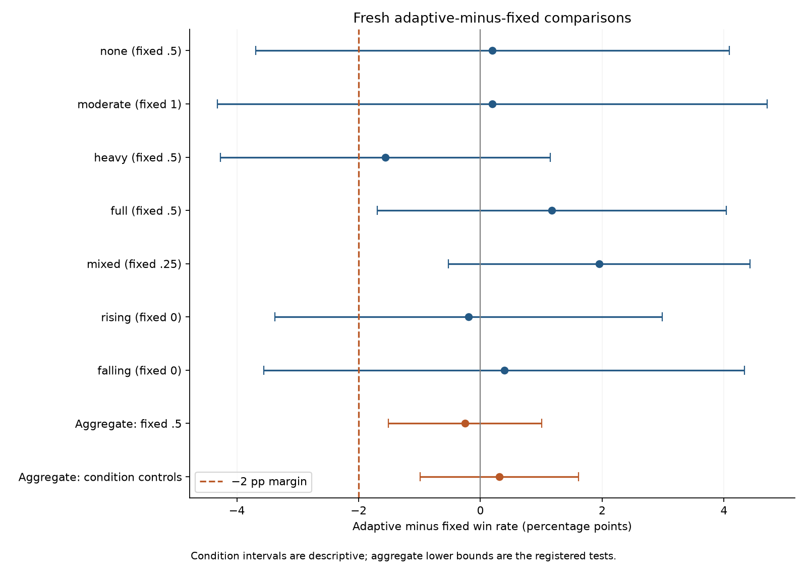
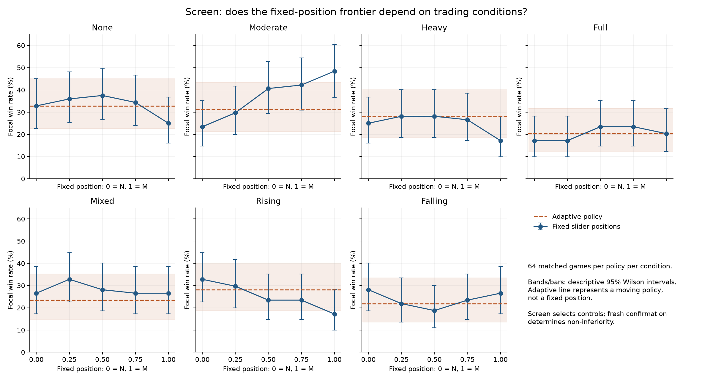
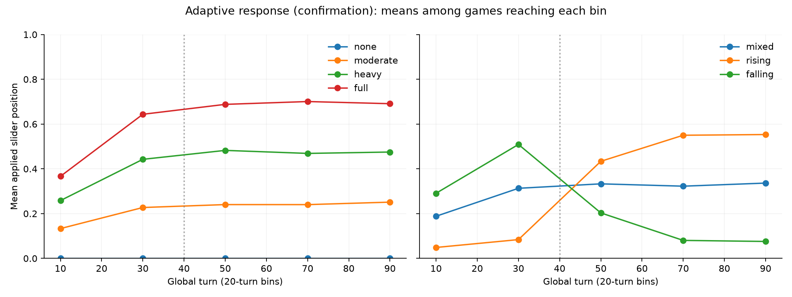

# Validating the direct adaptive curve

The direct adaptive slider passed both registered aggregate non-inferiority
comparisons on fresh native HexSet games. It supports using one automatic policy
across the tested trading conditions with a 2-percentage-point tolerance; it does
not establish superiority or an optimal curve. The [plan](PLAN.md), policy,
window, margin and sample rule were frozen before results were observed.

| Fresh comparison | Adaptive wins | Control wins | Difference | Registered lower bound | Result |
| --- | ---: | ---: | ---: | ---: | --- |
| Global fixed .5 | 977/3,584 | 986/3,584 | -0.25 pp | -1.51 pp | Pass |
| Condition-selected fixed controls | 977/3,584 | 966/3,584 | +0.31 pp | -0.99 pp | Pass |

Both one-sided 97.5% lower bounds exceed -2 pp. The adaptive win rate is 27.26%,
versus 27.51% and 26.95%. These are paired comparisons on fresh boards, with
seven conditions weighted equally. Per-condition precision is lower.



The current slider runs from N (the current no-trade move profile) to M (the
best previously validated trading policy). Thus fixed .5 here is halfway
between N and M; it is not M itself. Every seat uses the T exchange evaluator
with floor zero. Candidates differ only in their fixed position or the
production adaptive rule. Real games and information histories are native
HexSet throughout; Catanatron is neither host nor opponent.

## Completed screen

64 games per policy and condition; five fixed positions plus adaptive A.
Seven conditions, 2,688 games, completed in 417.84 seconds with 30 workers.
Eight extra control games matched full endpoint action/trade histories exactly.
All 64 screen no-trade adaptive/fixed-zero pairs also have identical complete
action digests and zero exchanges.

| Condition | Fixed0 | .25 | .5 | .75 | 1 | Adaptive |
| --- | ---: | ---: | ---: | ---: | ---: | ---: |
| None | 21 | 23 | 24 | 22 | 16 | 21 |
| Moderate | 15 | 19 | 26 | 27 | 31 | 20 |
| Heavy | 16 | 18 | 18 | 17 | 11 | 18 |
| Full | 11 | 11 | 15 | 15 | 13 | 13 |
| Mixed | 17 | 21 | 18 | 17 | 17 | 15 |
| Rising | 21 | 19 | 15 | 15 | 11 | 18 |
| Falling | 18 | 14 | 12 | 15 | 17 | 14 |

The screen selects fixed .5 as the strongest global control (128/448 wins;
adaptive 119/448). Selected condition controls are .5,1,.5,.5,.25,0,0 in table
order (148/448 combined). The conditional control's apparent advantage is
selection-biased in these data; it must be assessed on fresh boards. These
64-game cells do not establish a continuous optimum or a monotonic curve.

The independent audit checked all 2,688 games: source identities, complete and
balanced samples, correct entrant-to-seat mapping, positive-gain whole-game
trade records, public event participants, every logged activity and applied
alpha, and the selected controls and sample-size calculation.

## Fresh confirmation

The registered variance formula selected 512 games per policy per condition.
The uncapped target was 457.36; the 1024 cap did not apply. Planning targets 80%
power per primary contrast under equal true strength, not 80% joint power.
Three policies (A, global .5, selected condition control) would require 10,752
games. Where the two controls are identical, they share one cohort, reducing
the actual run to 9,216 games without reducing either comparison's sample.

Each primary comparison uses 3,584 matched boards across seven equally weighted
conditions. Both one-sided 97.5% lower bounds must exceed -2 percentage points
for the registered non-inferiority claim. This controls family-wise error at 5%
for the two aggregate contrasts. Per-condition 95% intervals are descriptive;
passing aggregate non-inferiority does not certify the margin in every
condition or prove a globally optimal curve. No outcome-driven sample extension
was used.

The fresh confirmation completed all 9,216 games in 1,420.53 seconds. Together
with the screen, this is 11,904 strength games plus eight behavior controls in
30.64 minutes of evaluation-pool time. The independent audit checked every
confirmation record and reconstructed every logged adaptive value exactly from
public events, alongside source identities, seats, sample census and contrasts.

| Condition | Selected fixed position | Adaptive wins /512 | Fixed .5 wins /512 | Selected control wins /512 | A minus selected, pp (95% interval) |
| --- | ---: | ---: | ---: | ---: | --- |
| None | .5 | 129 | 128 | 128 | +0.20 [-3.69, 4.08] |
| Moderate | 1 | 150 | 161 | 149 | +0.20 [-4.32, 4.71] |
| Heavy | .5 | 131 | 139 | 139 | -1.56 [-4.27, 1.14] |
| Full | .5 | 121 | 115 | 115 | +1.17 [-1.69, 4.04] |
| Mixed | .25 | 140 | 132 | 130 | +1.95 [-0.52, 4.43] |
| Rising | 0 | 136 | 150 | 137 | -0.20 [-3.38, 2.99] |
| Falling | 0 | 170 | 161 | 168 | +0.39 [-3.55, 4.34] |

Condition intervals are descriptive. The selected controls' apparent advantage
in the screen did not persist on fresh data; selection noise is a reason to
retain the independent confirmation. The curve and eight-turn window were not
retuned after either stage.



## What the diagnostics measure

Activity and applied alpha are logged at the first focal decision of each
global turn. The bot may update again after that turn's trade event; these
summaries are not an average over every within-turn action. Every logged value
can be reconstructed from public observations preceding that decision.

Phase bins average within game first, then across games reaching the bin.
Late-bin means therefore condition on continued play. The rising/falling
pre/post statistic pairs bins 20–39 and 60–79 within games that reach both.
Absolute step sizes and sign reversals describe motion, not proof of harmful
oscillation. A responsive signal need not select a strong weight position.

Fresh confirmation mean activity was 0 without trading, .204 moderate,
.392 heavy, .561 full, .281 mixed, .228 rising and .304 falling. Activity stayed
exactly zero at every logged decision in all 512 no-trade adaptive games.
Rising activity increased alpha by .468 in 380 games reaching both comparison
bins; falling activity reduced it by .417 in 341 paired games. These diagnostics
verify response direction; the separate strength comparisons support aggregate
non-inferiority. At full participation not every eligible turn produces a
mutually beneficial exchange, so an activity estimate below 1 is expected.



## Reproduction

Production source bcb9b92; plan/driver committed 3c1e1cc before launch.
Source fingerprint:
`d2df60dd0abeb72f1bd0ae4222716ce1b4246ac249c64cd2d76aeb0aa611b001`.
Python 3.12.14 / NumPy 2.5.2, Docker image
`sha256:58c092875440c770999bada97e0ec7c5178b68fbe640bf3f5a131bc8a624f7be`.
One 30-worker, 30-CPU pool, evaluation network disabled, BLAS/OpenMP threads 1,
PYTHONHASHSEED=0. The host supplied about 29.2 CPUs during the measured screen
snapshot; other concurrent application load was small.

From that frozen source export with PYTHONPATH=/study/src:

```sh
python docs/readouts/slider-curve/run.py --stage screen --out /out/screen
python docs/readouts/slider-curve/run.py --stage confirmation \
  --selection /out/screen/summary.json --out /out/confirmation
```

Archive each completed output directory and run `analyze.py` independently.
`plot.py` generates PNG and SVG figures from audited analysis JSON; plotting
dependencies were installed separately and never enter the evaluation runtime.
Raw records, original summaries, audited analyses and SHA256 sidecars remain
separate. Screen seeds 724000000; fresh seeds 725000000, plus 10000 per condition;
antithetic=False. No verification replay is counted as a strength sample.

Within each condition, every candidate faces identical opponent settings.
Across conditions, some opponent move profiles also differ deliberately.
These comparisons test robustness across environments; changes between curves
must not be attributed to trade frequency alone. Moderate, heavy and full
hold opponent move profiles at M while varying participation.


Archive SHA256 values:

- Screen: `abf2ade4d1f71b85e6cdb03d8672ab4cdc3bcf39d9ac22da9af1ec2652ed5f6b`.
- Confirmation: `b2d92acef26852a613423d3422e63cf55524ee0c9a2c644fcec300ec78b123bf`.

The subsequent [adaptive shape screen](../slider-shape/README.md) tested square
and square-root mappings against this linear policy. Neither qualified for
fresh confirmation; linear remains unchanged. This original non-inferiority
result validates its strength, not an optimal functional shape.
