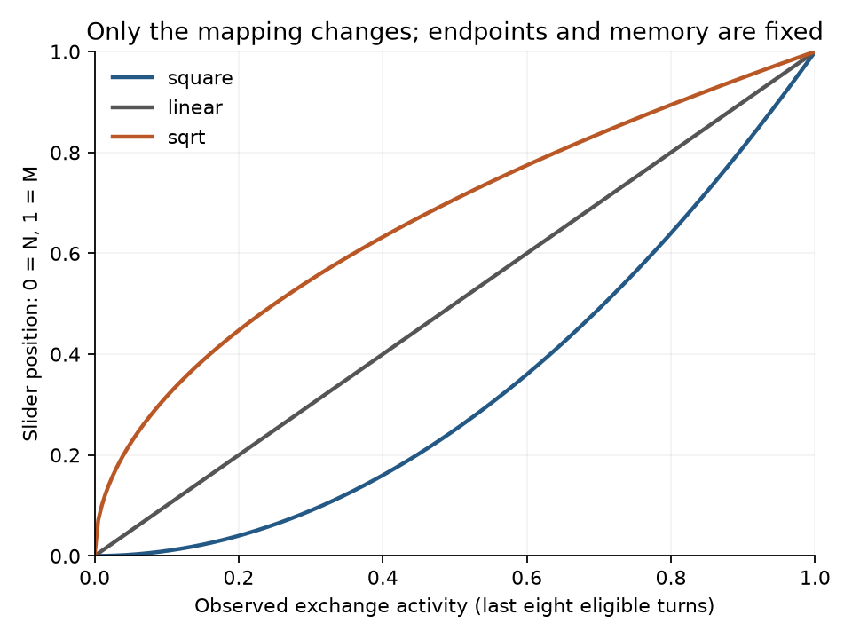
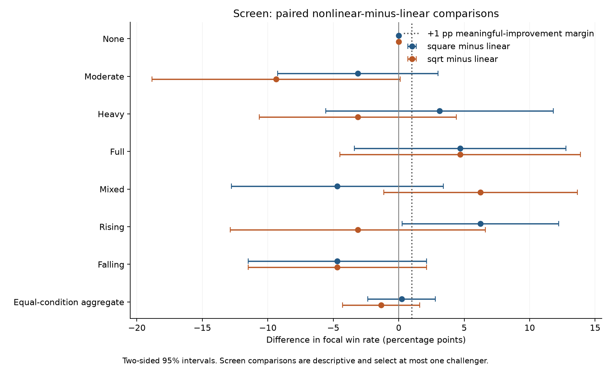
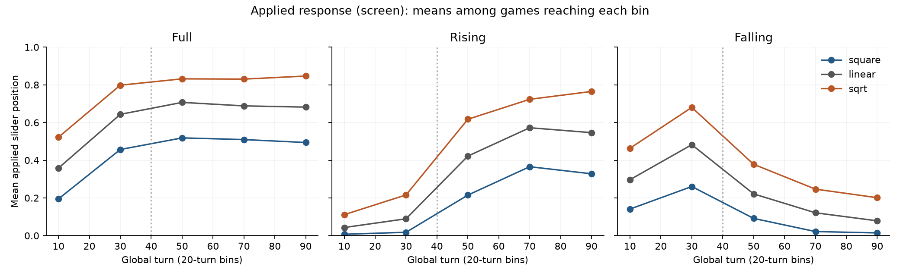

# Adaptive shape comparison: retain linear

Neither nonlinear mapping qualified for fresh confirmation under the frozen
[plan](PLAN.md). Square finished one win ahead of linear, and square root six
wins behind, across 448 matched boards per policy. We retain the current linear
policy and stop this study. The screen does not prove linear is optimal or that
smaller nonlinear gains are absent.

| Mapping | Wins /448 | Win rate | Difference from linear | Descriptive paired 95% interval |
| --- | ---: | ---: | ---: | --- |
| Square: activity² | 118 | 26.34% | +0.22 pp | [-2.36, +2.80] pp |
| Linear: activity | 117 | 26.12% | — | — |
| Square root: √activity | 111 | 24.78% | -1.34 pp | [-4.29, +1.61] pp |

These are new screen data, separate from the preceding successful
[linear-policy non-inferiority confirmation](../slider-curve/README.md).
Differences are paired within each condition; seven conditions receive equal
weight. Neither screen contrast is a confirmatory superiority test.



## Decision rule and outcome

The plan and runner were committed at a3565b4 before launch. Screen the three
curves on 64 boards per condition, then select the nonlinear curve with most
wins, preferring square on ties. It may advance only with an estimated gain
of at least +1 percentage point and a one-sided 80% lower bound above zero.
Square was selected, but its +0.22 pp estimate and -0.88 pp lower bound fail
both gates. There is no fresh confirmation, extra screen sample or curve tuning.

Had a challenger qualified, its independent confirmation would require a
one-sided 95% lower bound above +1 pp, with sample size determined by the frozen
variance rule. Non-inferiority alone would not justify replacing linear with
another equally automatic policy. The wider screen intervals still allow
potential gains; this is a bounded compute-allocation decision, not a finding
that all curves have exactly equal strength.

## Conditions and results

One focal policy faces three controlled Heximax opponents. All real gameplay,
search and information histories use native HexSet; no Catanatron host or player.
Endpoints N/M, eight-turn observation memory, expansion interpolation, T exchange
evaluator, floor zero, search and opponent settings remain fixed. Only the
mapping changes. Linear uses the unmodified production adaptive policy.

| Condition | Square wins /64 | Linear wins /64 | Square-root wins /64 |
| --- | ---: | ---: | ---: |
| None | 12 | 12 | 12 |
| Moderate | 21 | 23 | 17 |
| Heavy | 16 | 14 | 12 |
| Full | 20 | 17 | 20 |
| Mixed | 18 | 21 | 25 |
| Rising | 21 | 17 | 15 |
| Falling | 10 | 13 | 10 |



The regimes reuse the preceding study's opponent participation probabilities
and move profiles. Every candidate faces identical settings within a condition;
moderate, heavy and full hold opponent move profiles at M while changing
participation. Some other conditions deliberately use different move profiles,
so differences between conditions cannot be attributed only to trade frequency.
Small per-condition samples do not justify selecting a new mapping per condition.

## Behavior and audit

The independent analyzer audited all 1,344 strength games plus ten behavior
controls. It checked complete balanced seats, frozen source/runner/plan hashes,
whole-game trade records, gains, public participants, paired wins and the frozen
selection rule. Every logged raw activity and mapped alpha reconstructs exactly
from preceding public events, without reading hidden participation probabilities.

All 64 no-trade strength boards have identical full action digests across the
three curves and zero exchanges. The six preflight no-trade games match full
actions, outcomes and trade histories; four trading control games establish
exact parity between an identity-mapping observer and production linear.
Synthetic controls cover all nine possible window fractions, exact endpoints,
expiration of old observations and opportunity filtering.

The curves produced substantially different weight positions despite similar
observed activity. In the full-participation condition, mean raw activity was
.566/.567/.570 for square/linear/square root, while mean applied alpha was
.386/.567/.715. This verifies that the experiment actually exercised the mapping.
It does not establish that any of those positions is optimal.



Logs capture the first focal decision of each global turn, not every within-turn
move. Phase plots average within each game and then across games reaching the
bin; late bins condition on continued play. Different choices can change later
trades, so raw activity trajectories need not be identical between policies.

## Runtime and reproduction

The complete screen and behavior controls took 226.92 seconds (3.78 minutes),
using one 30-worker pool capped at 30 CPUs. A snapshot showed 28.83 CPUs used by
the screen and 1.17 CPUs collectively used by other containers. The screen exited
successfully; no confirmation pool was launched. Detailed receipts: [runtime.json](runtime.json).
Plotting dependencies were separate from the evaluation environment.

Production remains bcb9b92 with source fingerprint
`d2df60dd0abeb72f1bd0ae4222716ce1b4246ac249c64cd2d76aeb0aa611b001`.
The shape mappings are experimental runner code; no production preset changed.
Python 3.12.14 / NumPy 2.5.2, Docker image
`sha256:58c092875440c770999bada97e0ec7c5178b68fbe640bf3f5a131bc8a624f7be`,
network disabled, PYTHONHASHSEED=0 and BLAS/OpenMP threads=1. Seeds 726000000 plus
10000 per condition; preflight seed 726900000. Independent boards, antithetic=False,
with all four focal seats balanced. The archived candidate seat is Outcome.seating[0].

From the frozen export, with PYTHONPATH=/study/src:

```sh
python docs/readouts/slider-shape/run.py --stage screen --out /out/screen
```

Preserve that output directory in an archive with `screen/` at its root:

```sh
python docs/readouts/slider-shape/analyze.py \
  docs/readouts/slider-shape/screen-games.tar.gz --stage screen \
  --out /tmp/shape-screen-analysis.json
python docs/readouts/slider-shape/plot.py \
  --screen /tmp/shape-screen-analysis.json --out /tmp/shape-figures
```

Original [summary](screen-summary.json), independent [analysis](screen-analysis.json),
[raw records](screen-games.tar.gz) and [checksum](screen-games.sha256) remain separate.
Archive SHA256: `aa7feff67578fd1fb559a4f7a02cc1022584156984dab149f32607af8a07ed6d`.
